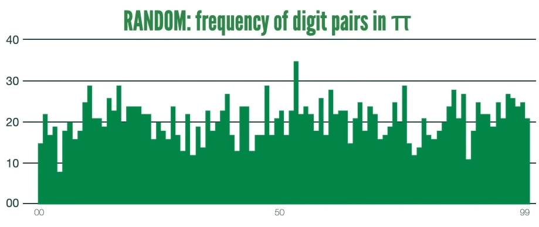

# Benford's law
Some math statistics application in python

This work is inspired by Matt Parker ([Stand-up Maths](https://standupmaths.com/)) video "[Why do Biden's votes not follow Benford's Law?](https://youtu.be/etx0k1nLn78?si=qWTPNqYUe9_z5BcN)" from November 2020.

## Distribution for Benford's law

Still to be done ...

## Random distribution of last two digits

I tried to rework the distribution of the last two digits from the Pi digits for the first 2069 places. (see 13:18 in the video to get a random verifiable distribution)

My reference result should look like this:



One hour later:


With just 12 lines of code the exact distribution can be recreated. A nice learning experience! Here the code:

``` py
import matplotlib.pyplot as plt
import numpy as np
import math_pi
precincts = 2069 # 2069
source_pi = math_pi.pi(b=precincts*2)
random_two_digits = [31]
for i in range(1,precincts):
    two_digits = int(source_pi[i*2+1:i*2+3])
    random_two_digits.append(two_digits)
plt.hist(random_two_digits, bins=100)
plt.grid(axis = 'y')
plt.show()
```
